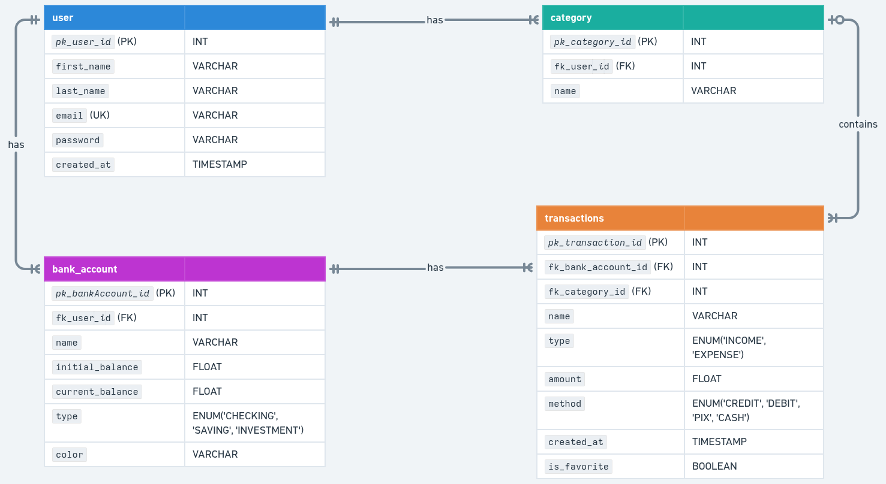

# CashTrack

CashTrack is a personal finance management app that helps users stay in control of their money: manage bank accounts, categorize transactions, and visualize statistics about spending and income over time.

## Table of Contents

- [About the project](#about-the-project)
- [Tech stack](#tech-stack)
- [Entity-Relationship Diagram](#entity-relationship-diagram)
- [Use cases](#use-cases)
- [Getting started](#getting-started)
- [Project structure](#project-structure)
- [Roadmap](#roadmap)

## About the project

CashTrack allows the user to:

- Manage multiple bank accounts (checking, saving, investment)
- Record income and expense transactions, linked to categories and payment methods
- Organize transactions with custom categories
- View consolidated statistics: totals by period, expenses by category, and month-over-month comparisons

## Tech stack

**Backend**

- [Node.js](https://nodejs.org/) + [TypeScript](https://www.typescriptlang.org/)
- [Express](https://expressjs.com/) — HTTP framework
- [Prisma](https://www.prisma.io/) — ORM
- [PostgreSQL](https://www.postgresql.org/) — database

**Infrastructure**

- [Docker](https://www.docker.com/) / Docker Compose

**Frontend**

- [Next.js](https://nextjs.org/)

## Entity-Relationship Diagram



## Use cases

### Authentication

**UC01 — Register account**

- **Actor:** User
- **Main flow:**
    1. User enters e-mail and password
    2. System checks that the e-mail is not in use
    3. System saves the user
- **Alternative flow:** E-mail already registered → system displays an error and doesn't create the account

**UC02 — Log in**

- **Actor:** User
- **Main flow:**
    1. User enters e-mail and password
    2. System authenticates the user
- **Alternative flow:** Invalid credentials → system displays an error

### Bank Account

**UC03 — Create bank account**

- **Actor:** User
- **Main flow:**
    1. User enters name, initial value, and account type (Checking, Saving, Investment)
    2. System saves the bank account

**UC04 — Edit/delete bank account**

- **Actor:** User
- **Main flow:**
    1. User selects an existing account
    2. Edits name/type, or requests deletion
    3. System saves the change or removes the account
- **Alternative flow:** Account has existing transactions → system asks for confirmation before deleting

### Categories

**UC05 — Manage categories**

- **Actor:** User
- **Main flow:**
    1. User can create, edit, or delete a category
    2. When deleting a category in use, the system reassigns the related transactions to "Empty category"

### Transactions

**UC06 — Manage transactions**

- **Actor:** User
- **Main flow:**
    1. User can create, edit, or delete a transaction
    2. When creating/editing, the user enters: bank account, type (income or expense), amount, category, and payment method (Cash, Pix, Debit/Credit Card)
    3. System saves the transaction and updates the balance of the corresponding bank account

**UC07 — List/filter transactions of a bank account**

- **Actor:** User
- **Main flow:**
    1. User applies filters (bank account, category, date, type, method, favorites)
    2. System displays the filtered transactions

**UC08 — Favorite a transaction**

- **Actor:** User
- **Main flow:**
    1. User checks/unchecks a transaction as a favorite
    2. System updates the transaction status

### Financial Statistics

**UC09 — Display totals**

- **Actor:** User
- **Main flow:**
    1. System sums transactions of type "expense" within the selected period → total expenses
    2. System sums transactions of type "income" within the selected period → total income
    3. System calculates the final balance (income - expenses)
    4. User can view the totals of a specific account or the consolidated total across all accounts

**UC10 — Display expenses by category**

- **Actor:** User
- **Main flow:**
    1. System groups the month's expenses by category
    2. System displays the result (e.g., a chart or list with percentages)

**UC11 — Compare months**

- **Actor:** User
- **Main flow:**
    1. User selects one or more months
    2. System displays a comparison of expenses and income for the selected period

## Getting started

### Prerequisites

- [Docker](https://www.docker.com/) and Docker Compose installed

### Steps

1. Clone the repository:

    ```bash
    git clone <repository-url>
    cd cashtrack
    ```

2. Set up the backend environment variables:

    ```bash
    cp backend/.env.example backend/.env
    ```

    > Fill in the `.env` file with your database connection string and any other required variables.

3. Start the containers:
    ```bash
    docker compose up --build
    ```

This will start:

- **`cashtrack_api`** — Node.js/Express API, available at `http://localhost:8000`
- **`cashtrack_db`** — PostgreSQL database, available at `localhost:5432`

### Running migrations

With the containers up:

```bash
docker exec -it cashtrack_api npm run migrate:dev
```
